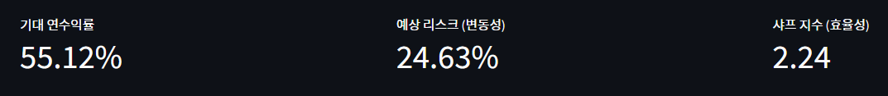
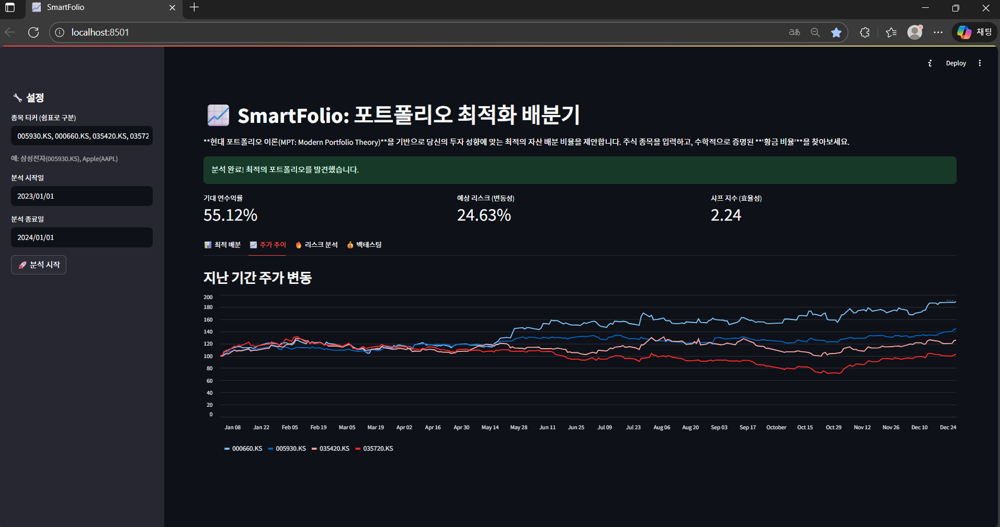

## SmartFolio_The efficient Frontier (포트폴리오 최적화 배분기)

### 사용자가 주식 종목들을 입력하면, ‘현대 포트폴리오 이론(MPT)’에 따라 리스크 대비 수익률이 가장 높은 황금 비율을 찾아주는 도구

- 투자자의 감을 배제하고, 수학적 데이터에 기반하여 Risk-Adjusted Return(위험 조정 수익률)을 극대화하는 자산 배분 비율을 제안한다
- SmartFolio는 예측이 아닌 ‘대응’의 영역인 수학적 자산 배분(Asset Allocation)에 집중하고자 했다.
- `Scipy` 의 최적화 알고리즘을 활용해, 논리적이고 과학적인 투자를 돕는 도구

### [이론적 배경]

- 경영 지식
    - 현대 포트폴리오 이론 (Harry Markowitz): **“계란을 한 바구니에 담지마라”**
        1952년 Harry Markowitz가 창시해 노벨 경제학상을 받은 이론으로, “수익률만 보지 말고, 위험(risk)도 같이 봐라”가 핵심이다.
        - 여러 주식(자산asset)을 섞어서 투자하면, 수익률은 유지하면서 위험(변동성)만 낮출 수 있다는 ‘분산 투자의 마법’을 수학적으로 증명한 것이다.
        - 그래서 한 종목에 모두 담지 않고, `weights` (비중)이라는 변수를 만들어서 여러 종목에 0.2, 0.3, 0.5,… 이렇게 나누어 담는 시뮬레이션을 돌린다.
    - Sharpe Ratio (샤프지수): 위험 1단위당 초과 수익률
        - “위험을 1단위 감수했을 때, 은행이자보다 얼마나 더 벌었는가?”를 나타내는 지표이다.
        - 코드에서 results[2,i] 부분이 수익률/리스크(표준편차)를 계산한것이다. 이 값이 클수록 가성비가 좋은, 훌륭한 포트폴리오라고 할 수 있다.
    - Efficient Frontier (효율적 투자선): 동일한 위험 수준에서 최대 수익을 내는 포트폴리오의 집합
        - 동일한 위험 수준에서 낼 수 있는 ‘최대 수익률’의 점들을 이은 선이다. 이 선 아래에 있는 포트폴리오들은 비효율적 투자이고, 선 위에 있는 것들이 효율적인 조합이다.
        - 5,000번 시뮬레이션을 돌려 점을 찍으면 부채꼴 모양의 곡선이 생기는데, 그 곡선의 가장 윗부분 테두리가 바로 효율적 투자선이다.

### [Tech Stack]
    - language: Python
    - Web Framework: Streamlit
    - Data Analysis:
        - `Pandas`
        - `NumPy` : 행렬 연산(공분산 행렬 계산)
        - `Matplotlib` : 수천 개의 시뮬레이션 결과를 산점도(Scatter plot)로 시각화
        - `yfinance` : 실제 주식 데이터 크롤링 (별도 라이브러리)
    - Machin Learning: Scikit-learn (Leodit-Wolf Covariance)
    - Math & Optimization
        - `SciPY` : Optimization 기능을 사용하여 샤프 지수가 최대가 되는 지점을 수학적으로 계산
    - Visualization: Plotly Express

### [Feature]
    - Data Fetching: `yfinance` API를 통해 실시간 주가 데이터 확보
    - Monte Carlo Simulation: 5,000번 이상의 시뮬레이션을 통해 가능한 투자 조합 분석
    - Robust Statistical Analysis: Ledoit-Wolf Shrinkage를 사용해   서 estimation error와 noise를 줄임.
    - Visual Analysis: `Matplotlib` 을 이용한 효율적 투자선(Efficient Frontier) 시각화
    - 웹 UI 구축(Streamlit):
        - 종목 코드를 입력하는 텍스트 상자 추가
        - “분석 시작” 버튼 생성
        - 기간 설정 (1년/3년/5년) 슬라이더 추가
    - Backtesting
        - “과거 1년 전에 이 비율로 투자했다면, 지금 얼마를 벌었을까?”를 계산해서 보여준다
        - “수익률 + 15.4% (예상 수익금: 1,500,000원)” 처럼 숫자를 띄운다
    - 상관관계 히트맵(Correlation Heatmap)
        - “삼성전자와 하이닉스는 같이 움직여 분산투자 효과가 적습니다”를 색깔로 보여주는 차트 추가

### [코드 구현 상세 설명]

- 데이터 pipeline
    
    Input → Preprocessing → Calculation → Visualization
    
    사용자 입력이 시각화로 즉시 이어지지 않고, 수학적 검증 단계를 거치도록 설계
    
1. 수익률과 리스크(공분산) 계산
    ```
    daily_returns = data.pct_change().dropna() #일간 변동률계싼
                mean_returns = daily_returns.mean() * 252  # 연간 기대 수익률
               # (수정)Shrinkage Covariance (Ledoit-Wolf) 적용
                # 일반적인 sample_cov보다 노이즈에 robust
                lw = LedoitWolf()
                # sklearn은 (n_samples, n_features)를 원함
                lw.fit(daily_returns) 
                cov_matrix = lw.covariance_ * 252 
                # 다시 DataFrame으로 변환 (인덱스 유지를 위해)
                cov_matrix = pd.DataFrame(cov_matrix, index=tickers, columns=tickers)
    ```
    - 일간 변동률 계산: 주가의 절대 가격이 아니라, 비교가능한 수익률로 데이터를 정규화한다.
    - 주가는 매일 변하기 때문에, `put_change()` 로 ‘일간 등락률’을 구한다. 하지만  ‘연간(Yearly)’을 알아야하기에, 주식 개장일인 252일을 곱해서 연 단위로 scaling해준다
    - `cov()` 는 공분산(Covariance)다. 리스크를 계산할 때 필수적으로, 삼성전자가 오를 때 하이닉스도 같이 오르는지(양의 관계), 아니면 반대로 가는지(음의 관계)를 행렬로 만든 것이다.
    - 그런데 일반적인 표본 공분산은 과거 데이터의 noise와 outliers까지 과도하게 학습하는 경향이 있어, 미래 risk를 왜곡할 가능성이 높다.
    그래서, scikit-learn의 Ledoit-Wolf Shrinkage 기법을 적용해, noise가 많은 표본 공분산 행렬을 shrink해서 estimation error을 최소화하여 시장의 일시적인 충격에 휘둘리지 않는 robust portfolio를 구성하고자 했다.

2. Monte Carlo Simulation
    ```
    for i in range(num_portfolios):
	weights = np.random.random(len(tickers))
	weights /= np.sum(weights) #weights합=1(100%)
    ```
    - `Scipy` 의 `minimize` 함수를 쓸려 했지만 시각화를 위해 점을 많이 찍어야한다. 그래서 5,000번 정도로 랜덤하게 비중을 섞다보면(Random Sampling), 최악의 조합도 있고 최악의 조합도 있을 것이다. 모든 경우의 수를 그래프에 뿌려서 눈으로 확인하고자 했다.

3. 포트폴리오 리스크 수학적 계산
    ```
    p_std_dev = np.sqrt(np.dot(weights.T, np.dot(cov_matrix, weights)))
    ```
    - $\sigma_p = \sqrt{w^T \cdot \Sigma \cdot w}$
    - 종목이 n개 이기 때문에, 행렬 곱(dot product )을 사용했다. 각각의 비중과 서로 간의 상관관계(공분산)을 모두 고려해 전체 포트폴리오의 ‘통합리스크’를 계산하는 공식이다.

4. 레이아웃 설계
    - 사용자가 데이터를 입력하는 control영역과 결과가 나오는 출력(Display) 영역을 분리했다.
    - 한 화면에 두면, 종목이 늘어날수록 스크롤이 길어져서 한눈에 결과를 보기 힘들다.
    - 따라서, `st.sidebar` 를 활용해 ‘입력은 왼쪽, 결과는 오른쪽’에 배치되도록 직관적인 구조를 잡았다.
    - `st.sidebar.header("🔧 설정")` , `st.sidebar.text_input(...)`, `st.sidebar.date_input(...)`, `st.sidebar.button(...)`
    - 결과화면도 `st.tabs` 를 사용해 ‘요약 정보’, ‘상세 그래프’,’통계 데이터’를 탭으로 구분해서 사용자가 정보 overloading되지 않도록 했다.
    - `tab1, tab2, tab3 = st.tabs(["📊 최적 배분 비율", "📈 주가 추이", "🔥 리스크 분석"])`
    - `with tab1:`, `with tab2:`, `with tab3:` 블록으로 각 탭에 성격이 다른 정보 (비중 pie chart, 주가 라인 chart, 상관관계 히트맵)을 분산해서 배치했다

5. 데이터 정합성 및 예외 처리 (Robustness)
    - 외부 API(`yfinance` )는 네트워크 상태나 오타에 의해 실패할 수 있다. 프로그램이 비정상 종료되는 것을 막기 위해
    
    1) 사용자가 입력한 종목 코드를 `strip()` 으로 공백 제거해 정제한다.
    2) `try-except` 문으로 인터넷 연결이 끊기거나 API error가 나면 `st.error` 을 띄우게 했다.
    3) 데이터를 받아와도 `if data.empty:` 검사로, 빈 데이터로 계산을 시도하다 에러나는 것을 막았다

6. ‘변동률’ 중심의 데이터 전처리
    - `daily_returns = data.pct_change().dropna()`
    - 주식의 가격(price)자체는 비교 불가능한 데이터다. (삼성전자 6만원 대, Tesla는 300달러 대). 1주당 100만원짜리 주식과 1,000원짜리 주식의 움직임을 ‘원(Won)’단위로 비교하면 왜곡이 발생한다. 서로 단위가 다른 데이터를 비교하기 위해 normalization과정을 거쳐야한다.
        이를 비율로 통일해서 가격이 다 다른 종목들도 같은 선상에서 비교할 수 있게해야한다. 그럼 데이터의 평균과 분산이 일정하게 유지되는 stationarity를 확보할 수 있다.
    - `put_change()` 를 통해 모든 데이터를 ‘어제 대비 몇 퍼센트 변했나’라는 “비율(Rate)”로 변환했다. 첫날은 비교 대상(어제)이 없어서 `NaN` (Not a Number)이 생기는데, 이를 `dropna()` 로 제거한다.

7. 연산 성능 최적화
    `np.dot(weights.T, np.dot(cov_matrix, weights))` 
    - `for loop` 로 5000번의 시뮬을 돌리기는 힘들다. 따라서 `Numpy` 의 행렬 연산(Vectorization)을 활용했다. 단순 반복문 대신에 선형대수 공식을 코드로 옮겨서, 공분산 행렬(`cov_matrix`)과 가중치 벡터(`weights`)를 한 번에 곱하는 방식을 선택했다

8. 4. 정적 그래프 대신 인터랙티브 시각화
    - `Matplotlib` 는 고정된 이미지라서 수천개의 시뮬레이션 결과가 밀집되어있는 효율적 투자선 영역에서 개별 포트폴리오의 구체적인 수치를 확인하기 어려울 수 있겠다고 생각했다. 대략적인 추세뿐 아니라, 특정 리스크 수준에서 기대 수익률 차이를 비교하는 정밀한 의사결정이 요구되어지기 때문이다.
    - 상호작용이 가능한 `Plotly`로 사용자가 그래프를 확대하고, 마우스를 올리면 Risk-Return Trade-off를 심층적으로 탐색(Drill-down)할 수 있게했다.
    - 단순히 그래프를 제시하는 것을 넘어, 의사결정을 도울 수 있어야한다는 것이 이 프로그램의 목표이기 때문이다.

### [화면 상세분석]
1. 상단의 핵심지표 (Key Metrics)
    
    - 기대 연수익률 (55.12%):
        - “과거 데이터 패턴대로라면, 이 비율로 투자했을 때 1년에 약 55.12%의 수익을 기대할 수 있다”는 뜻이다.
        - 단순히 종목들의 수익률을 평균낸 것이 아니라, 제안된 비중(weight)를 가중 평균한 값
    - 예상 리스크(24.63%)
        - 금융에서 risk는 표준편차를 의미한다.
        - “수익률이 55.12%를 중심으로 위아래로 약 +-24.63% 정도 흔들릴 수 있다”는 뜻이다. 낮을 수록 안정적인 투자라고 할 수 있다.
    - 샤프 지수 (2.24): 투자 효율성 지표
        - (수익률 ÷ 리스크)로 계산된다.
        - 이 숫자가 높을수록 ‘적은 위험으로 좋은 수익을 냈다’는 뜻이다. 2.24이라는 숫자를 maximize하는 조합을 찾아낸 것이다.

2. Asset Allocation Pie Chart (도넛 차트)
    
    - “사용자가 가진 돈(100%)을 어떻게 쪼개야 하는가?”에 대한 **황금비율**이다.
    - 예시
        - 035420.KS (네이버): 45.4% → 돈의 절반가까이를 네이버에 넣으세요
        - 000660.KS (SK하이닉스): 18.7% → 약 20%를 하이닉스에 넣으세요
        - 005930.KS (삼성전자): 28.5% → 30% 정도 삼성전자에 넣으세요
        - 035720.KS (카카오): 7.39% → 카카오는 리스크 대비 수익기여도가 낮으니 7%만 넣으세요
        ⇒ 5,000번 계산해 보니 카카오를 많이 넣으면 포트폴리오 전체 리스크(변동성)가 너무 커지거나 샤프 지수가 떨어지기 때문에 optimization의 결과로 나온 판단이다.
    - 예시2
        - 000660.KS (SK하이닉스): 55.3%
        - 005930.KS (삼성전자): 44.7%
        - 035420.KS (네이버): 0.000000000000019%
        - 035720.KS (카카오): 0%
        - 해석: 과거 1년 데이터를 보니, 네이버와 카카오는 가지고 있어도 수익은 마이너스이거나 제자리인데, 리스크(변동성)만 높다. 내 포트폴리오 점수(샤프 지수)만 감소하니 사실상 매도하는 게 좋다. 그리고 수익률이 압도적으로 좋았던 하이닉스와 삼성전자에 몰아넣어라.
        - 실제로, 2023년에 SK하이닉스와 삼성전자는 AI반도체(HBM) 이슈로 주가가 2배 가가이 폭등했다. 반면, 네이버와 카카오는 금리 인상과 플랫폼 규제 등으로 주가가 하락하거나 횡보했다.
        - 인간의 감이나 기대심리를 배제하고, 수학적 데이터(Sharpe Ratio)에 근거해 수익이 없는 자산을 포트폴리오에서 제거한것이다

3. Stock Price Trend (주가 추이) : 상대적 성과 비교
    
    어떤 종목이 시장을 주도했고, 어떤 종목이 하락세인지 직관적으로 파악할 수 있다. 앞의 pie chart에서의 자산 배분 결과를 뒷받침하는 근거가 된다.

    - 그래프의 시작점을 모두 100으로
    그래프 왼쪽을 보면 삼성전자(7만원), 네이버(20만원) 등 가격이 다 다른 종목들이 모두 100에서 출발하고 있다. 그냥 그래프를 그리면 y축 스케일 차이로 인해 삼성전자 그래프는 바닥에 깔려서 보이지 않는다. (Scale difference)
    그래서, 모든 종목의 시작일 가격을 100점으로 normalization했다. y축은 가격(원)이 아니라 ‘수익률지수(index)’다. 100보다 위에 있으면 이익(+), 100보다 아래에 있으면 손실(-)구간임을 알 수 있다.
    
    - 선의 기울기(slope)와 변동성
    그래프 모양이 곧 수익률(Return)과 리스크(Risk)를 의미한다.
        - SK하이닉스: 100에서 시작해 180~200까지 치솟았다. (즉, 1년만에 약 80~100% 수익)
        - 삼성전자: 100에서 시작, 140 정도에서 끝났다. (약 40% 수익) 꾸준히 우상향해서 안정적이다.
        - 카카오: 100에서 시작, 100 아래로 나려갔다. (원금 손실)

4. Correlation Analysis (리스크 분석)
    
    - Heatmap 색상이 의미하는 것
    상관계수(Correlation Coefficient)를 색깔로 표현한 것이다.
        - Red, +1에 가까움: 함께 움직인다. a가 오르면 b도 오르고, a가 떨어지면 b도 떨어진다.
        - Blue, -1에 가까움: 반대로 움직인다. a가 오르면 b는 떨어지고, a가 떨어지면 b는 오른다. (hedging 효과)
    - 자기 자신과의 상관관계는 100%이기에 대각선은 모두 1이다.
    - 네이버(035420) vs. 카카오(035720)
        색깔이 연한 빨간색으로 수치가 0.7153124이다. 즉, 함께 움직인다. 왜냐하면 같은 ‘플랫폼 테마주’이기 때문이다.
        따라서, “네이버도 사고 카카오도 사는 건 분산투자가 아니라 그냥 플랫폼에 몰빵하는 것이다”라고 판단하여 투자 인사이트를 얻을 수 있다.
    - 만약, 이 Heatmap의 결과가 대부분 빨간색이었다면, “현재 포트폴리오가 특정 테마주에만 편중되어 있어, 시장 충격에 취약하다”고 시각적으로 파악하고 판단할 수 있다.
    여기에, 미국 국채나 금(gold)와 같은 종목을 섞으면, 파란색(음의 상관관계)이 나타나면서 서로의 위험을 상쇄해줄 수 있다.
    => 따라서, 이 차트는 사용자가 “내가 너무 비슷한 종목을 골랐구나. 다른 성격의 자산을 섞어야겠다!”는 판단을 도와주는 의사결정 보조 도구로 쓰일 수 있다.

4. Backtesting: 검증단계
    
    - 사용자가 설정한 기간의 첫날로 돌아가 1,000만원을 투자했다고 가정했을떄, 계좌 잔고가 매일매일 어떻게 변했는지를 보여준다.’
        - 하늘색 선 (AI 최적화): 이 프로그램이 계산한 ‘황금 비율’대로 투자했을 때의 자산 변화
        - 파란색 (단순 균등 투자): 모든 종목을 똑같이 (1/N) 나눠샀을 대의 자산 변화. 즉, 비교 대상이다.